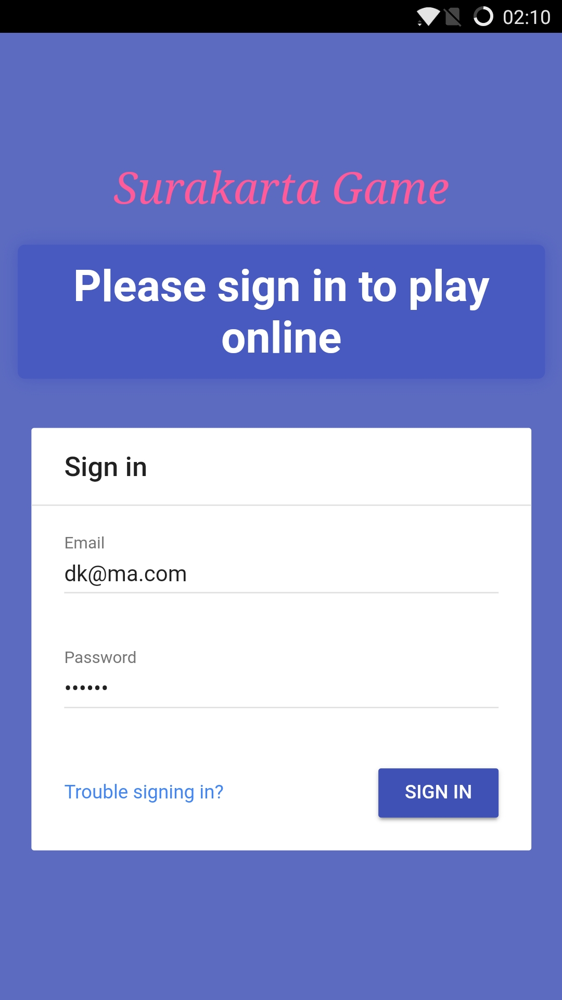
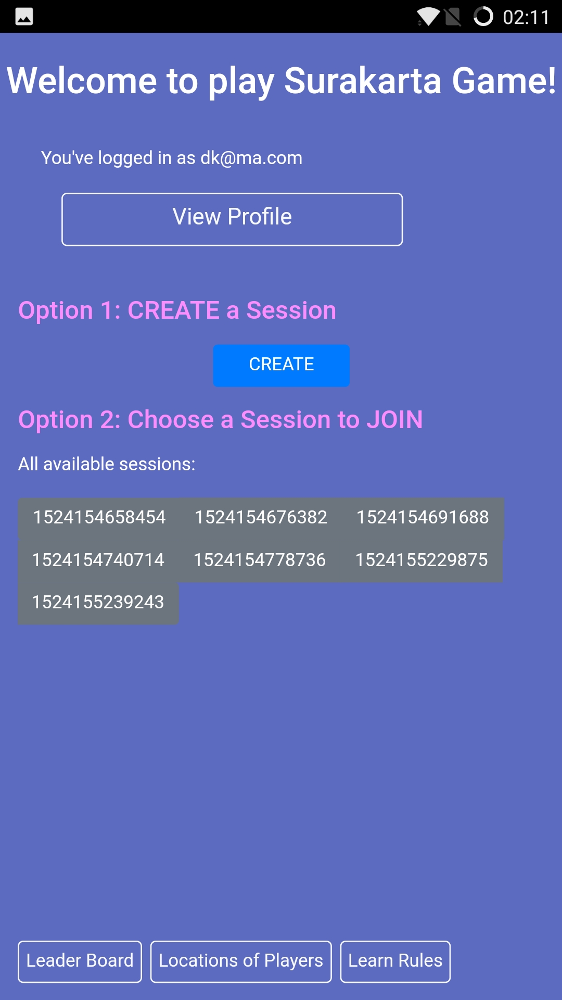
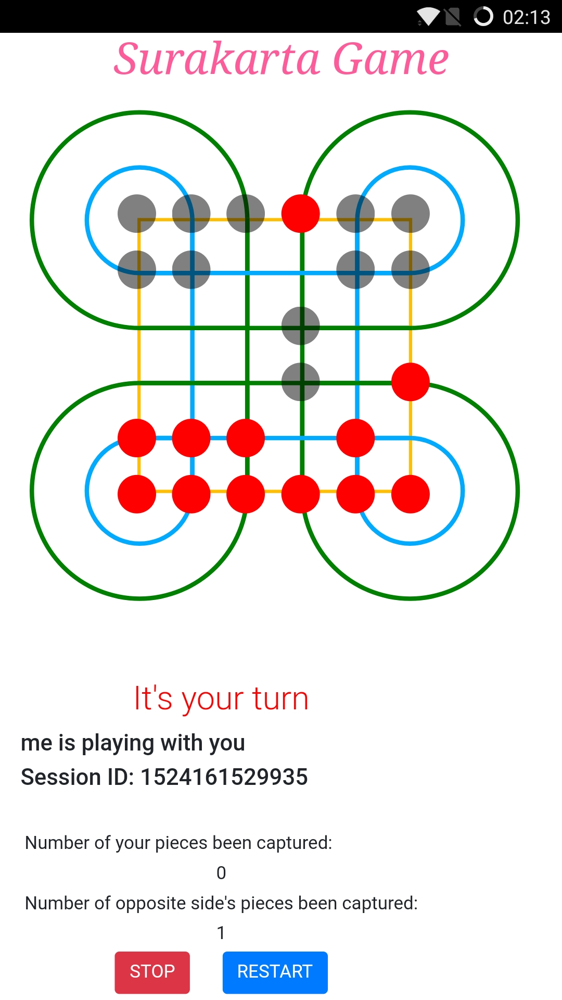
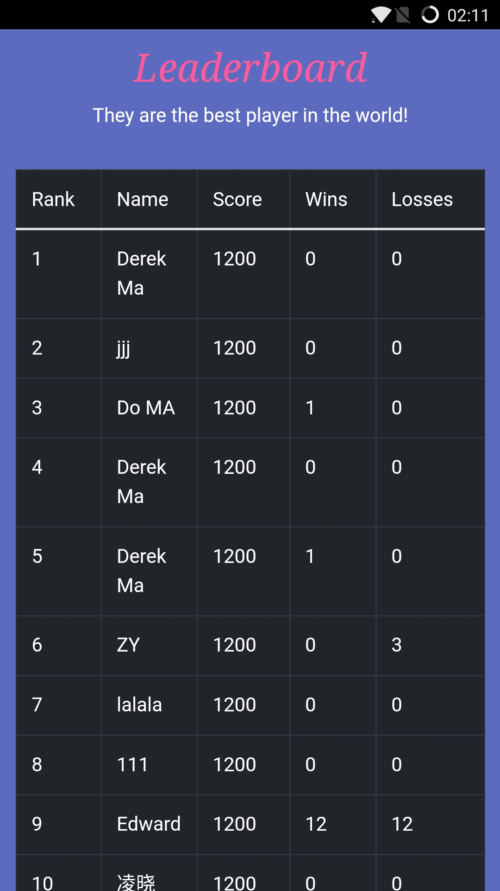
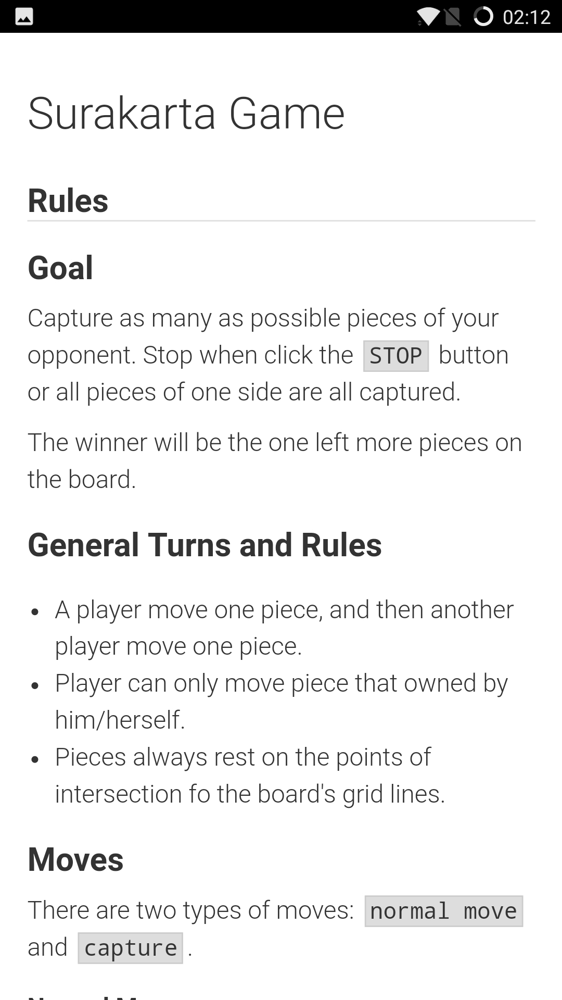

# Surakarta Game

**Download the app at the following link!**
https://github.com/derekmma/surakarta-game/raw/master/SurakartaGame.apk

## Installation Guide

- Recommended version: Android 7.0

1. Go to URL and download the `.apk` file:
2. Install on mobile device by click the downloaded `.apk` file
3. Grant all permissions needed by the application

## Functions

#### User login or create account at login page

#### Then user can get this main page to choose functions

#### User can create a session or join a available session to play the game!

*Pieces' positions and player operations will be synced between two players*

#### User can click the `Profile` button to review and modify their profile and current grades

#### User can click the `Location of Players` button to review locations and grades of all users

#### Clicking the `Leader Board` to show the leaderboard

#### Clicking the `Learn Rules` to learn the rule of this game

## Rules of the Game

### Goal

Capture as many as possible pieces of your opponent. Stop when click teh `STOP` button or all pieces of one side are all captured. 

The winner will be the one left more pieces on the board.

### General Turns and Rules

* A player move one piece, and then another player move one piece. 
* Player can only move piece that owned by him/herself.
* Pieces always rest on the points of intersection fo the board's grid lines.

### Moves

There are two types of moves: `normal move` and `capture`.

#### Normal Move

Only move to unoccupied point in any direction. Normal move can't go through circuits.

#### Capture

Go through at least one inner or outer circuit around the corners and unlimited number of unoccupied points, and then land on an enemy piece to capture it. 

The captured piece will be removed from the board, and the piece which capture others will stay at the location of captured piece.

### Demo Videos to Explain the Rules

https://www.youtube.com/watch?v=Q7p5faImfqI

https://www.youtube.com/watch?v=tUssoo6GySU

## Authors

* [Mingyu MA/Derek](https://derek.ma)
* Jinshan GU
* Zhenyuan MA
* Kuo-Hao FU
* Tsz Ling CHAU

