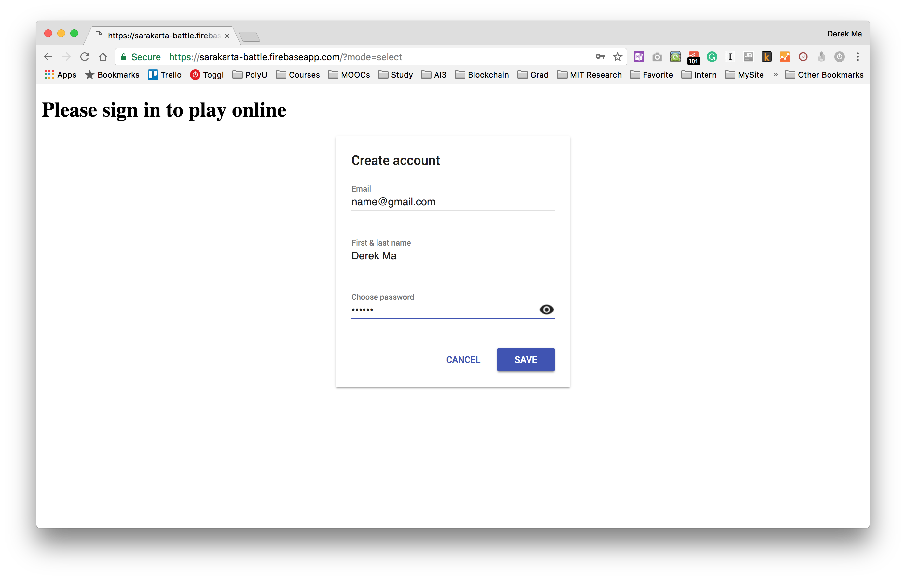
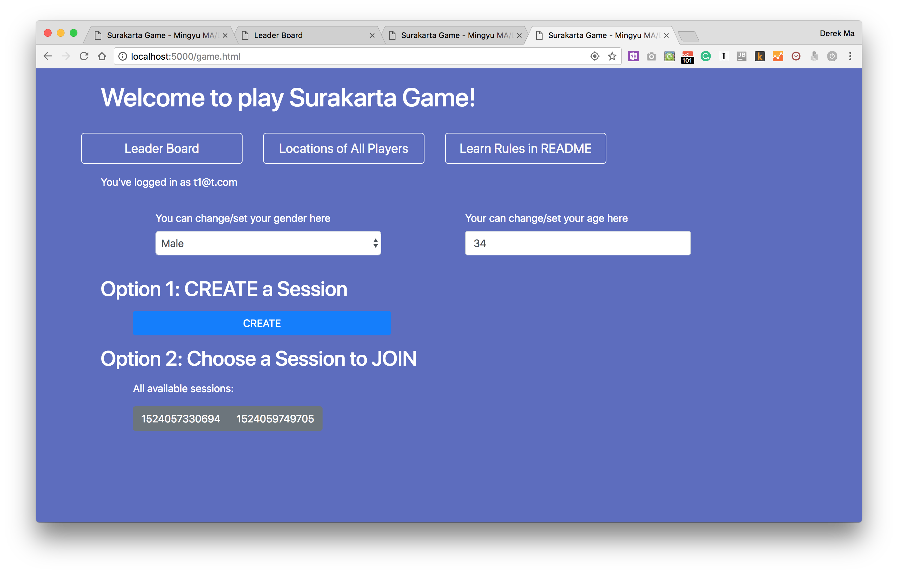
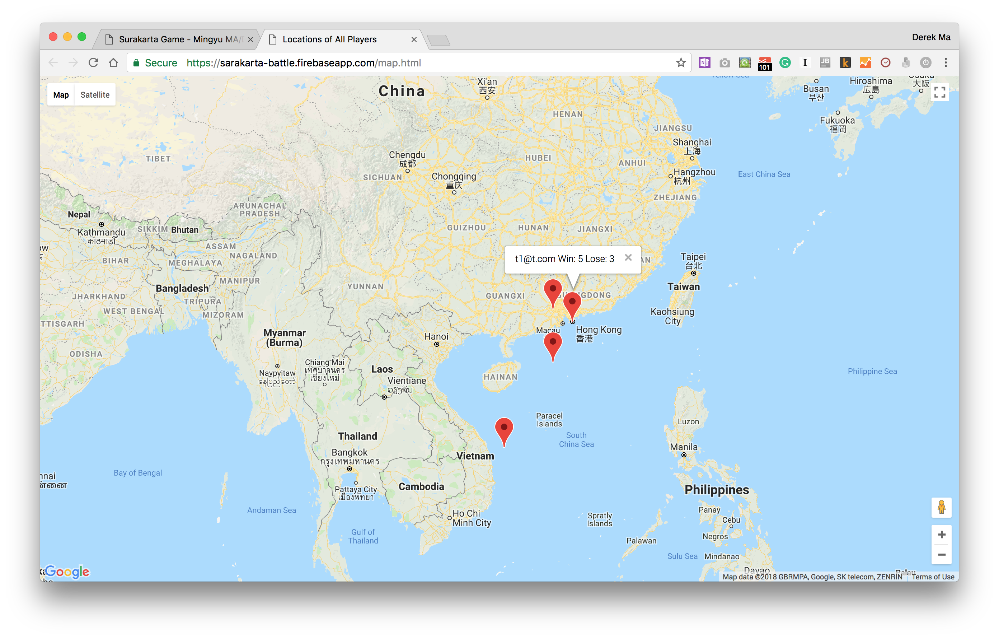
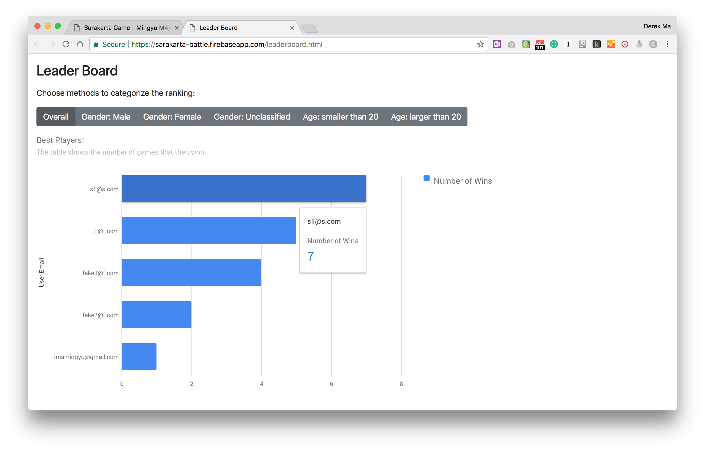
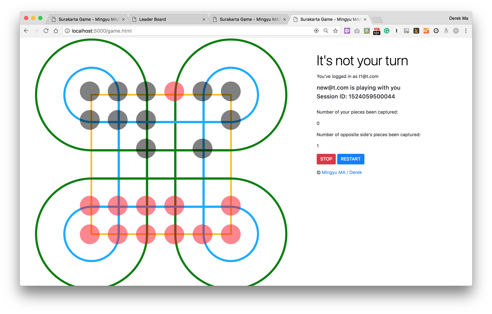

# Surakarta Game

**Play the game at the following link!**
https://sarakarta-battle.firebaseapp.com

## Functions


*User login or create account at login page*


*Then user can get this main page to choose functions*


*Show all users' locations and grades on the map*


*Show the leaderboard with best players. They can be categorized by click the filter tag*


*User can create a session or join a session created by other users.*

## Rules

### Goal

Capture as many as possible pieces of your opponent. Stop when click teh `STOP` button or all pieces of one side are all captured. 

The winner will be the one left more pieces on the board.

### General Turns and Rules

* A player move one piece, and then another player move one piece. 
* Player can only move piece that owned by him/herself.
* Pieces always rest on the points of intersection fo the board's grid lines.

### Moves

There are two types of moves: `normal move` and `capture`.

#### Normal Move

Only move to unoccupied point in any direction. Normal move can't go through circuits.

#### Capture

Go through at least one inner or outer circuit around the corners and unlimited number of unoccupied points, and then land on an enemy piece to capture it. 

The captured piece will be removed from the board, and the piece which capture others will stay at the location of captured piece.

## Deployment

To run the code locally, a server need to be run to ensure all functions are workable. 

Run following commands in Terminal:

1. Install `Firebase CLI` if you haven't

```
npm install -g firebase-tools
```

2. Use `firebase serve` to test web app:

```
firebase serve --only hosting
```

To deploy the web app on Firebase hosting, type following code in Terminal:

```
firebase deploy --only hosting
```

## Demo Videos

https://www.youtube.com/watch?v=Q7p5faImfqI

https://www.youtube.com/watch?v=tUssoo6GySU

